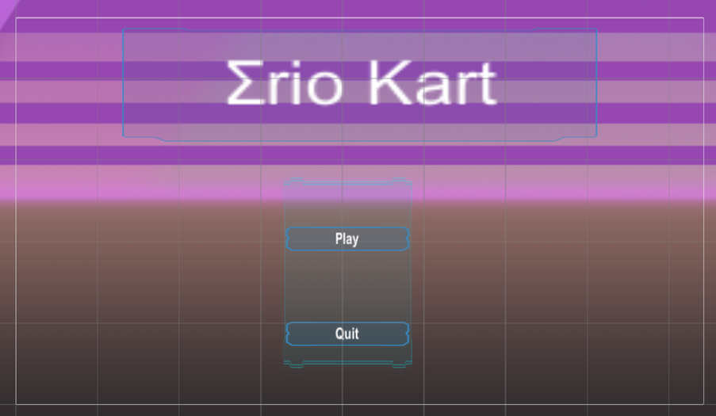
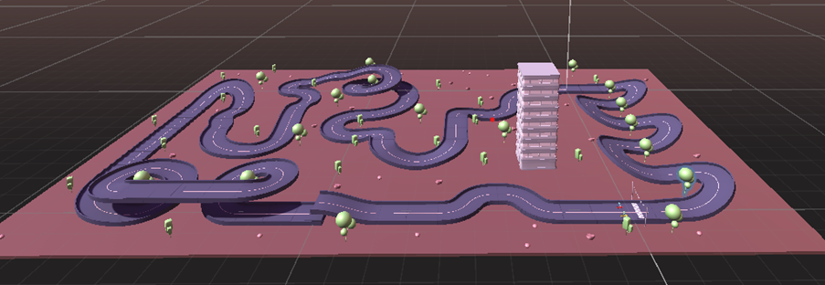
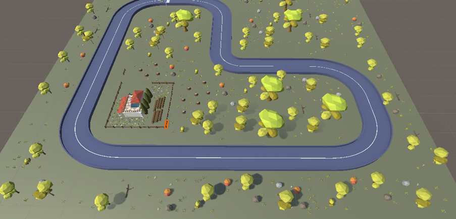
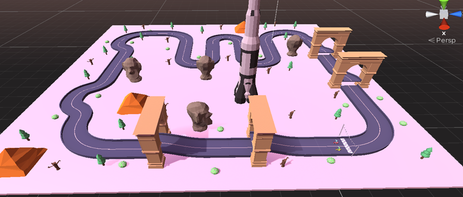
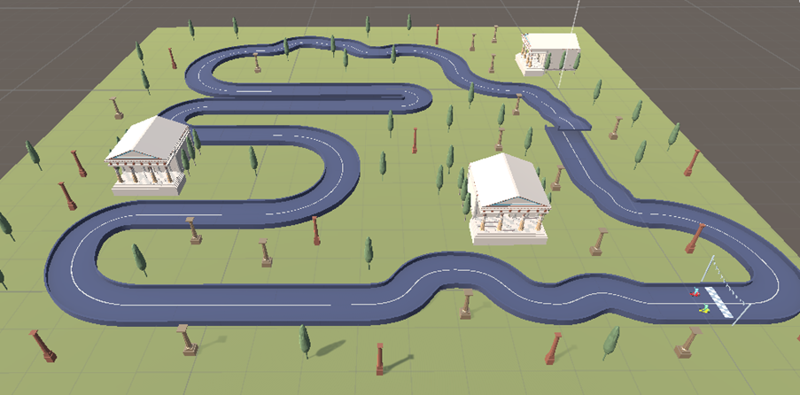

# Sigmario-Kart

My groupmate and I created a karting game called Σrio(Sigmario) Kart. We chose to make a karting game because we are both fans of the Nintendo game Mario Kart and are interested in how the karts drift and the AI-controlled karts run the track. We implemented several features, including kart drifting, AI karts, and different track topics.

To complete this project, we used the following assets:

Our course asset - Week_5_Assets.package
Low Poly Megapack – Lite by Terra Nova Creations
Karting Microgame by Unity Technologies
We also used some background music from the Kancolle soundtrack.

Our main menu has two buttons, "play" and "quit":

When the game starts, the player chooses a track with a specific topic:

#### The abandoned building in the desert

#### A farm in the forest

#### The rocket and the pyramid

#### The temple

The player controls the red kart, while the AI controls the yellow kart.

The winner is the first kart to hit the finish line and will receive 500 coins. The goal for players is to collect enough coins to talk to the girl in the start scene.

Both karts emit particles when they drift and gain acceleration. To implement the AI kart, we applied navigation to the track and set up many checkpoints to ensure that the AI kart could move to each checkpoint until it reached the finish line.

We wrote and modified several scripts, including:

#### AIController: controls the AI kart

#### AnotherController: allows players to control the kart and provides some engine sound

#### DriftAudio: we abandoned this script as it was not useful

#### FinishGame: changes the current scene to the start scene when either the player or the AI kart hits the finish line

#### FollowKart: sets up the camera to follow the kart

#### KartAudio: plays the engine starting sound and idle sound, and we used the script from Karting Microgame: ArcadeKartEngineSound.cs

#### MainMenu: controls the main menu buttons

#### SelectLevel: allows players to choose the track in the start scene

#### ShowMoney: displays the number of coins in the start scene

#### UIManager: displays the speed and running time during the game

To finish this game, we both wrote scripts and adjusted the kart coefficients, such as forward movement, turning, and drifting, and designed most of the scenes, tracks, and AI karts. We also performed debugging, documentation, and built the project.
